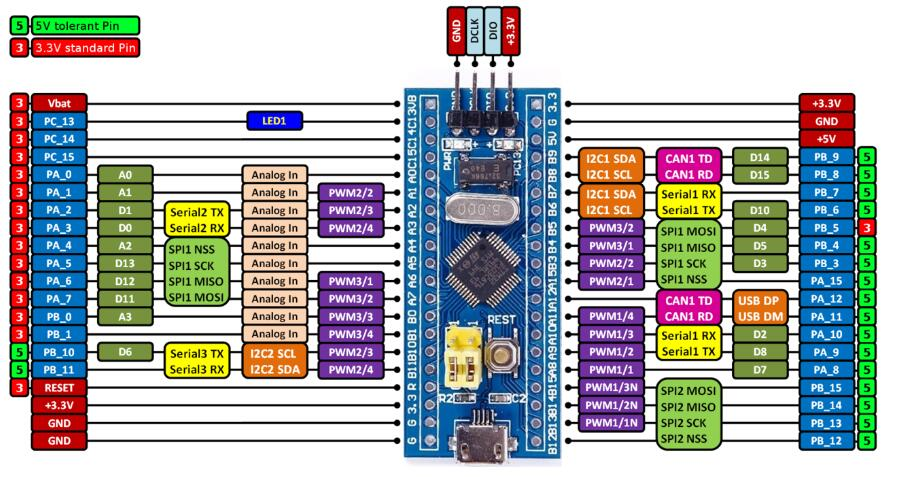

# Module: Humidity Temperature Monitor

## STM32F103C8T6

### The Minist System Board

- [STM32F103C8T6 Schemat](../Doc/STM32F103C8T6Schemat.pdf)

## SHT3x

### IIC Address

| SHT3x-DIS | I2C Address | Conditon |
| :------: | :------: | :-----: |
| Address A | 0x44 (default) | ADDR connected to logic low |
| Address B | 0x45 | ADDR connected to logic high |

### SHT30

#### Humidity Formula

Relative humidity conversion formula:

$$
RH(\%) = 100 \times \frac{S_{RH}}{2^{16} - 1}
$$

#### Temperature Formula

Temperature conversion formula:

$$
T(^\circ C) = -45 + 175 \times \frac{S_T}{2^{16} - 1}
$$

$$
T(^\circ F) = -49 + 315 \times \frac{S_T}{2^{16} - 1}
$$

## Reference

- [*STM32F103C8T6套装入门手册_V0.1*](../Doc/STM32F103C8T6套装入门手册_V0.1.pdf)
- [*SHT30-DIS datasheet*](https://sensirion.com/media/documents/213E6A3B/63A5A569/Datasheet_SHT3x_DIS.pdf)