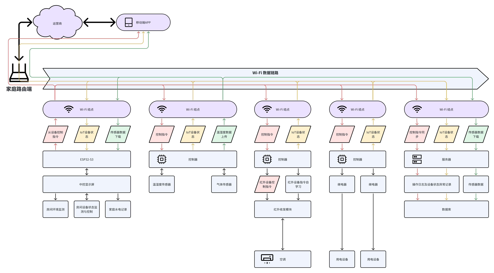

# IntelligentHome
A system for the control of home IoT devices comprising multiple nodes.

## Core Functions
- Support multi-node temperature & humidity monitoring
- Support multi-node gas composition monitoring
- Support multiple relay control
- Support Wi-Fi protocol
- Support the control of air conditioners through infrared modules
- Support infrared command self-learning mode
- Support displaying the sensor data & device status on the 10.8-inch center screen
- Support remote monitoring based on Harmony OS/iOS/Android and other platform apps

## Architecture

## Reference

## ChangeLog
- 2024/11/29
    - Created the `IntelligentHome` project;
    - Designed its architecture; 
    - First fill README.md

***
This project is being continuously updated ... (2024/11/29)